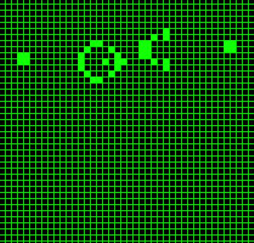

# [Conway's Game of Life](https://en.wikipedia.org/wiki/Conway%27s_Game_of_Life)

## Abstract

This is an implementation of Conway's Game of Life. The application allows the user to create a pattern of   their own or a randomly generated one. In addition, there's a pause feature that stops the game and allows  
the user to edit the board, and finally, a clear button in order to empty the grid. 
 
Requirements: [SFML](https://www.sfml-dev.org/)

In order to **run** the application:

    ~/git clone https://github.com/BouzoulasDimitrios/Game-of-Life.git
    ~/cd Game-of-Life/
    ~/cd Game-of-Life/ ./launch.sh
    

## Demo

 

***
A single Gosper's glider gun creating gliders:
***

 

 
 

